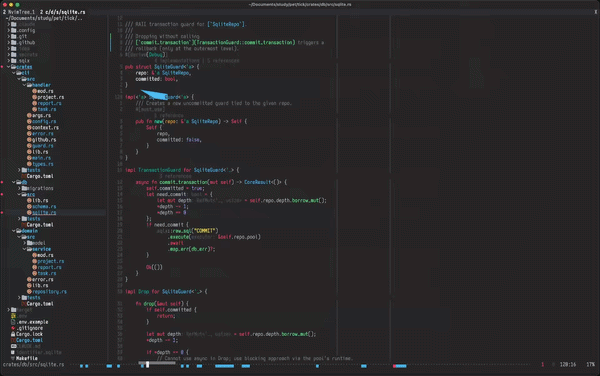

# fishbone.nvim

A horizontal "fishbone" position bar for Neovim's global statusline.

Renders the whole file across the bottom row of the screen: every buffer
line maps to a column on the bar. Like a one-line minimap.



## Installation

Requires Neovim 0.10+ and `laststatus=3` (set automatically).

**lazy.nvim:**

```lua
{
  'alchezar/fishbone.nvim',
  event = 'VeryLazy',
  opts = {},
}
```

**packer.nvim:**

```lua
use {
  'alchezar/fishbone.nvim',
  config = function() require('fishbone').setup({}) end,
}
```

## Layout

```
<file path> [+]   <bar>   <E> <W>  L:C  P%
```

Each cell composes a top half (overview) and a bottom half (signals):

**Top half** (`▀`, highest wins):

| Layer    | Color  | Source                                |
| -------- | ------ | ------------------------------------- |
| cursor   | white  | current cursor line                   |
| search   | pink   | lines matching the active `/` pattern |
| mark     | yellow | vim a-z marks, marks.nvim bookmarks, extmark bookmarks |
| viewport | silver | lines currently visible on screen     |

**Bottom half** (`▄`, highest wins):

| Layer      | Color  |
| ---------- | ------ |
| error      | red    |
| warn       | orange |
| git change | blue   |
| git add    | green  |
| info       | cyan   |
| hint       | purple |

Cells with both halves use `▀` with fg=top, bg=bottom. Cursor with no
bottom layer uses `█`. Empty cells use `·`.

**Deletes** are an overlay. A line adjacent to a removed git hunk gets a
red `▁` on empty cells, or a red underline added under the cell's existing
glyph - so a delete next to a cursor or diagnostic doesn't hide it.

**Staged hunks** keep showing on the bar after `:Gitsigns stage_hunk`, but
in a dimmer shade of the same color (add/change/delete). If the bright and
the dim marker land on the same column, the bright one wins. The dim color
follows `GitSignsStagedAdd` / `GitSignsStagedChange` / `GitSignsStagedDelete`
when the theme defines them, otherwise it's blended automatically from the
bright color toward the bar's empty-cell color.

## Setup

The minimum is just:

```lua
require('fishbone').setup()
```

Colors are resolved in this order, per layer:

1. `opts.colors.<name>` you pass to `setup()`
2. `fg` of a linked highlight group from your theme (see below)
3. Built-in fallback

Themed names (auto-pulled from highlight groups):

| Name         | Source highlight    |
| ------------ | ------------------- |
| `error`      | `DiagnosticError`   |
| `warn`       | `DiagnosticWarn`    |
| `info`       | `DiagnosticInfo`    |
| `hint`       | `DiagnosticHint`    |
| `git_add`        | `GitSignsAdd`           |
| `git_change`     | `GitSignsChange`        |
| `git_delete`     | `GitSignsDelete`        |
| `git_add_dim`    | `GitSignsStagedAdd`     |
| `git_change_dim` | `GitSignsStagedChange`  |
| `git_delete_dim` | `GitSignsStagedDelete`  |

If your theme defines those groups, fishbone follows along on `ColorScheme`
without any extra configuration. To override anything explicitly:

```lua
require('fishbone').setup({
  colors = {
    cursor   = '#FFFFFF',
    search   = '#FF77AA',
    mark     = '#FFD866',
    viewport = '#888888',
    git_add  = '#7FCC7F',  -- wins over GitSignsAdd
  },
})
```

### Extmark bookmarks

The yellow mark layer follows vim a-z marks and marks.nvim bookmarks out of
the box. If you keep bookmarks as extmarks in your own namespace instead, list
the namespace name(s) and fishbone lights up those lines too:

```lua
require('fishbone').setup({
  mark_namespaces = { 'user_bookmarks' },
})
```

Every extmark in a listed namespace marks its line; the namespace id is
resolved lazily, so it works even if the owning plugin loads after fishbone.

`setup()` also sets `laststatus=3` and installs a `%!` statusline expression.

## Mouse

- **Click** on the bar to jump the cursor to that line. `<C-o>` returns
  to the previous position (a jumplist entry is added on click).
- **Drag** to scrub the cursor smoothly along the file. Once a drag starts
  on the bar, mouse Y can leave the statusline row - the cursor still
  follows the X position; past the bar edges, X sticks at the extreme.

Works in terminal Neovim and Neovide.

## Soft dependencies

- [gitsigns.nvim](https://github.com/lewis6991/gitsigns.nvim) - git add/change/delete markers.
- [marks.nvim](https://github.com/chentoast/marks.nvim) - numbered bookmarks (vim a-z marks work without it).

Both are optional. The bar still renders if they're missing - those layers
just don't light up.

## Highlights

All highlight groups are generated by `setup()` from `opts.colors`. If you
want to override them per-colorscheme, the group names are:

- `FbnT_<name>` - top-only cells (`cursor`, `search`, `mark`, `viewport`)
- `FbnB_<name>` - bottom-only cells (`error`, `warn`, `git_change`,
  `git_add`, `git_change_dim`, `git_add_dim`, `info`, `hint`)
- `FbnT_<top>_B_<bot>` - both halves
- `<...>_D` - same, with bright (unstaged) delete underline overlay
- `<...>_DD` - same, with dim (staged) delete underline overlay
- `FbnCursorBlock`, `FbnBase`, `FbnDel`, `FbnDelDim`, `FbnFile`, `FbnDim`,
  `FbnInfoTxt`, `FbnErrorTxt`, `FbnWarnTxt` - misc

## License

MIT.
